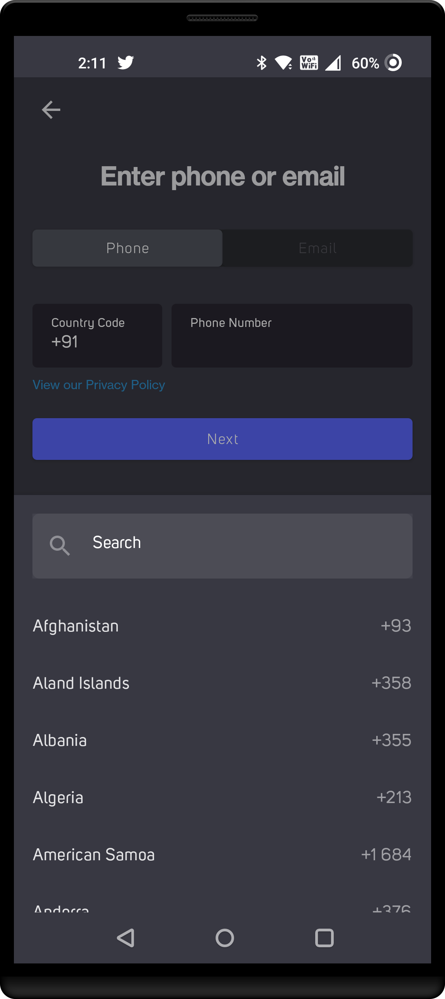
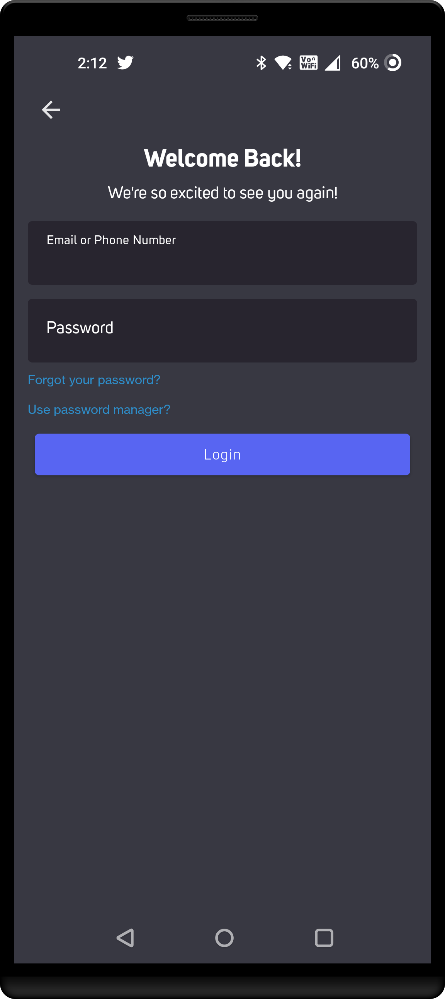
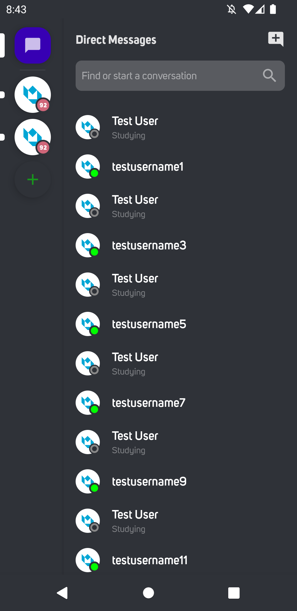
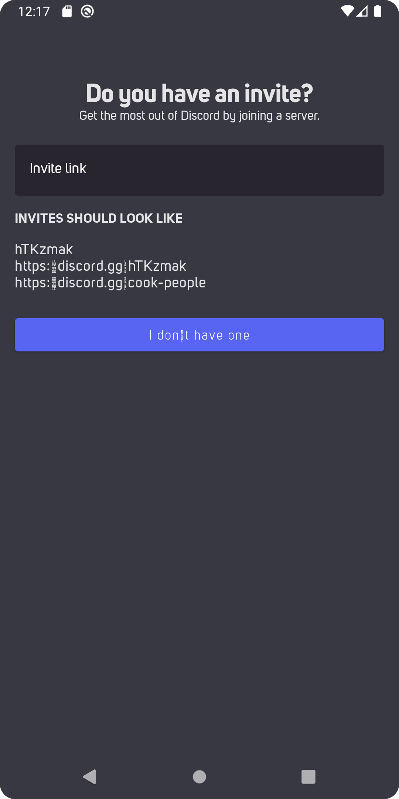
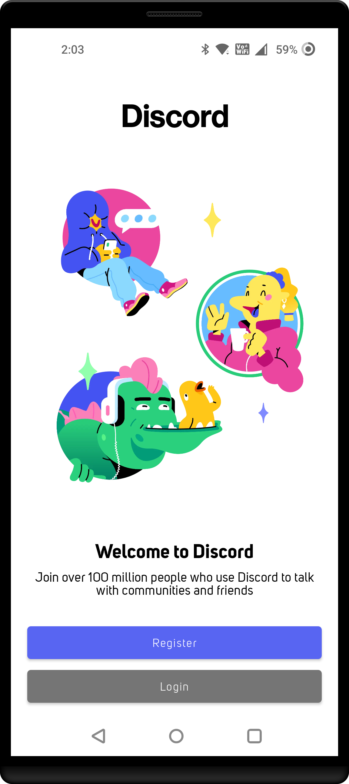
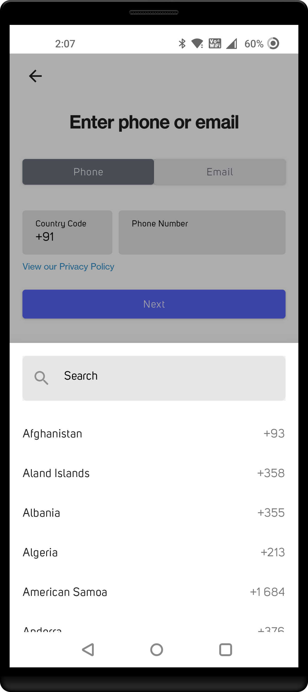
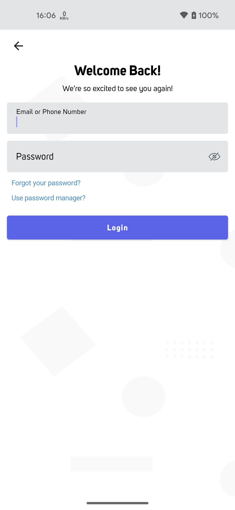
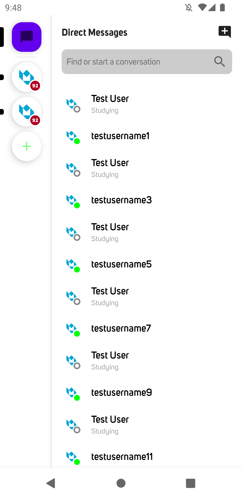

<table style="width:100%">
  <tr>
    <td>

## Discord Compose

 A clone of Android Discord app in Android built using Jetpack compose. 

    
    
    
    
    
    

### The purpose of this repository

- Build a fully functional Android app built entirely with Kotlin and Jetpack Compose.
- Follows Android design and development best practices with Compose.
- Explore the possibilities of creating complex ui and ux of a popular app like Discord using
  Compose.

### Status: 👨‍💻 In progress

Discord Compose is under active development.

</td> 
<td>
  
</td>
</tr>
</table>

### Stack

| Tools | Link |
|     :---      |          :---: |
| 🤖 Kotlin | [Kotlin](https://kotlinlang.org) |
| 💚 Jetpack Compose | [Jetpack Compose](https://developer.android.com/jetpack/compose) |
| 🏛 Architecture Components | [Android Architecture Components](https://developer.android.com/topic/libraries/architecture) |
| 💉 Dagger Hilt | [Dagger Hilt](https://developer.android.com/training/dependency-injection/hilt-android) |
| 🌐 Material Design | [Material Design](https://developer.android.com/jetpack/androidx/releases/compose-material) |
| 🌊 Coroutines | [Kotlin Coroutines](https://developer.android.com/kotlin/coroutines) |
| 🏄🏼‍♀️ Flows | [Flows](https://developer.android.com/kotlin/flow) |

## 🏛️ Architecture

Discord Compose follows the principles of Clean Architecture with Android Architecture Components.

[<a href="#top">Back to top</a>]

## 📷 Screenshots (Dark theme)

<table style="width:100%">
  <tr>
    <th>Welcome</th>
    <th>Register</th> 
    <th>Login</th>
    <th>Chat list</th> 
  </tr>
  <tr>
    <td></td> 
    <td></td>
    <td></td> 
    <td></td>
  </tr>
  <tr>
    <th>Invite</th>
  </tr>
  <tr>
    <td></td>
  </tr>
</table>

## 📷 Screenshots (Light theme)

<table style="width:100%">
  <tr>
    <th>Welcome</th>
    <th>Register</th> 
    <th>Login</th>
    <th>Chat list</th> 
  </tr>
  <tr>
    <td></td> 
    <td></td>
    <td></td> 
    <td></td>
  </tr>
  <tr>
    <th>Invite</th>
  </tr>
  <tr>
    <td></td>
  </tr>
</table>

[<a href="#top">Back to top</a>]
